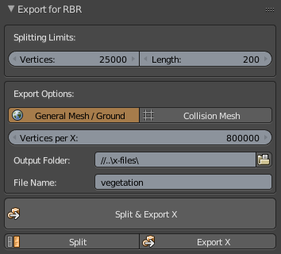

# Blender Export X for Richard Burns Rally
RBR editor needs imported mesh to meet many requirements, otherwise the model can't be imported without errors.
This Blender 2.79 addon prepares and exports the mesh so it can be imported right away, without any manual fixes.

## What does it do:
- mesh cleaning (reveal hidden vertices, remove doubles, delete loose)
- apply transformations
- separates by material
- splits into chunks by the settings (by max. vertex count and max. length)
- rotate & mirror in case of General / Ground Mesh export
- exports to X using correct exporter settings
- exports to multiple .x files using predefined max. vertex count per file (to avoid crashes on import)

## Tip:
- apply this 4GB patcher to editor .exe file, this allows you to import 2x large files https://ntcore.com/?page_id=371
- after applying the patch, you should be fine just with the default settings, which are:
  - max. vertex count per chunk: 25 000
  - max. length of chunk: 200 (meters)
  - max. vertex count per .x file: 800 000 (even 1M should be OK, you just need to stay below 300MB, ideally around 260MB)
